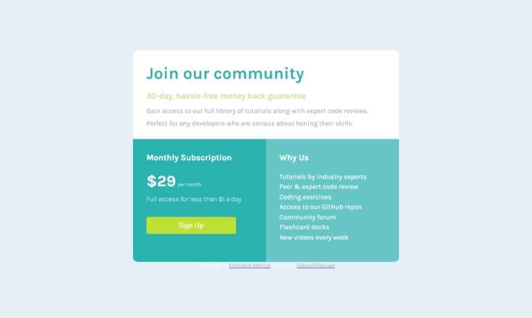

# Frontend Mentor - Single price grid component solution

This is a solution to the [Single price grid component challenge on Frontend Mentor](https://www.frontendmentor.io/challenges/single-price-grid-component-5ce41129d0ff452fec5abbbc). Frontend Mentor challenges help you improve your coding skills by building realistic projects. 

## Table of contents

- [Frontend Mentor - Single price grid component solution](#frontend-mentor---single-price-grid-component-solution)
  - [Table of contents](#table-of-contents)
  - [Overview](#overview)
    - [The challenge](#the-challenge)
    - [Screenshot](#screenshot)
    - [Links](#links)
  - [My process](#my-process)
    - [Built with](#built-with)
    - [What I learned](#what-i-learned)
    - [Continued development](#continued-development)
    - [Useful resources](#useful-resources)
  - [Author](#author)
  - [Acknowledgments](#acknowledgments)


## Overview

### The challenge
 The challenges I faced include

- View the optimal layout for the component depending on their device's screen size
- See a hover state on desktop for the sign Up call-to-action

### Screenshot




### Links

- Solution URL: [https://github.com/Rachy112/Singlepricegridproject](https://your-solution-url.com)
- Live Site URL: [https://rachealsingleprice.netlify.app](https://your-live-site-url.com)

## My process

### Built with

- Semantic HTML5 markup
- CSS custom properties
- CSS Grid
- Mobile-first workflow
- style-guide

### What I learned

what I learned while working on this project is the ability to think outside the box which helped me to solve some challenges i faced, and the ability to brainstorm with my collegues which bring the succes of this program. 
These are some codes that are of great samples and is a good way to reinforce my own knowledge.

```html
<p>HTML code I'm proud of</p>
<div>I'm so happy to have this HTML tag</div>
```
```css
.proudofthiscss {
  background-color: papayawhip;
  display: flex;
}
```

### Continued development

The areas i will like to continue focusing on include Cascading Style Sheets which describes how HTML elements are to be displayed on screen and other media and how it stand as a problem solver. CSS is wide and i will like to learn more about it.

### Useful resources
- [w3schools](https://www.W3schools.com) - This helped me with both CSS and HTML. I really liked the pattern and i will use it to learn more.
- [Scrimba](https://v2.scrimba.com) - This is an amazing video that explain both HTML and CSS ver well, which make coding more easy for me. I'd recommend it to anyone still learning this concept.


## Author
- Website - [Gabriel Rachael](https://www.instagram.com/rachy_world1)
- Frontend Mentor - [@rachy112](https://www.frontendmentor.io/profile/rachy112)
- Twitter - [@rachyworld](https://www.twitter.com/rachyword)


## Acknowledgments

I will like to appreciate my tutor, my course representative and some of my collegues who helped me out with the challenges i faced while working on this project. I'm happy to have you guys by my side and i hope we continue to be of help to one another in the future. Thanks.

